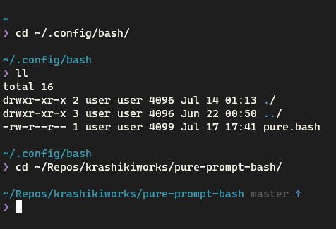

# pure prompt for bash
pure, the minimal prompt for bash

Inspired by [sindresorhus/pure](https://github.com/sindresorhus/pure)

## Install

just clone this repository (or just copy pure.bash) anywhere, and add

    source /path/to/pure.bash

to your `.bashrc`

## Uninstall

just remove what you downloaded, and delete `source` command from your `.bashrc`

## License

MIT License. See LICENSE.
